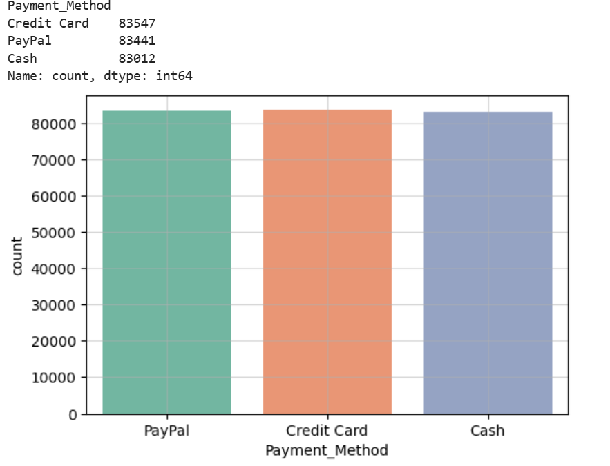
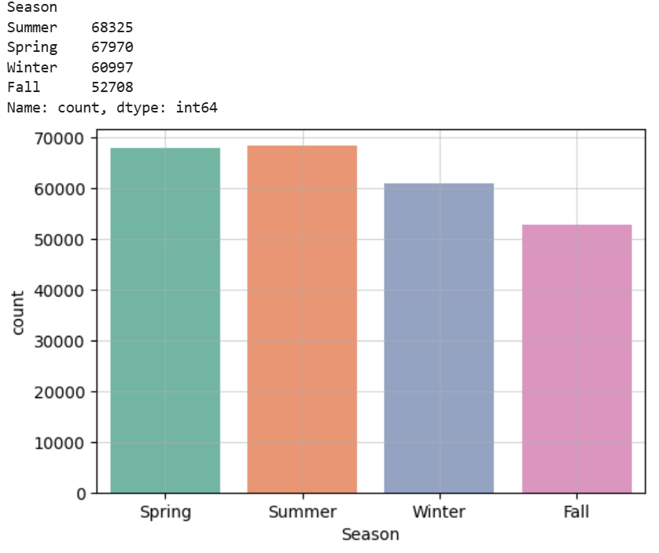
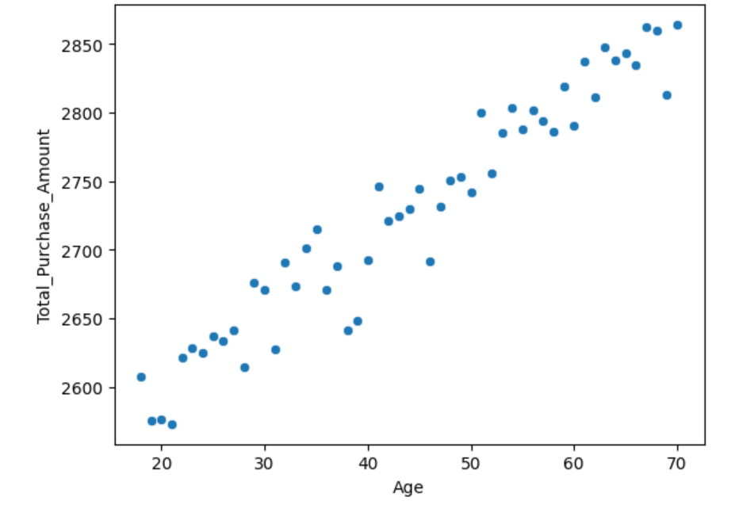
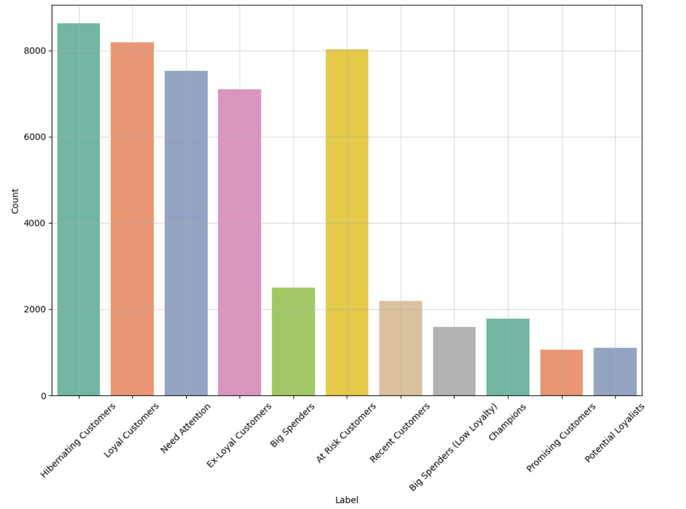
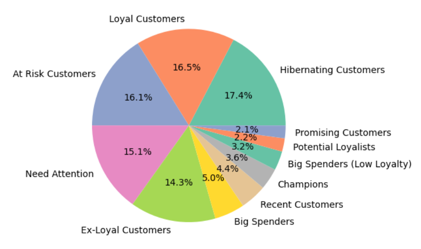

# Customer-Segmentation-Project
A project I created implementing customer segmentation using an artificial dataset from Kaggle.

Author: Brian Docena

# Introduction
The motivation for this project was during class when I learned K-Means Clustering. I thought the concept of creating clusters based on points' feature values was simple, but interesting and I thought about how it would be used in a real life scenario. This situation led me to want to implement clustering based on customer data. It would be hard to come across a dataset for this application because of privacy concerns, so I just searched for data on Kaggle that had interesting features. Sadly, this dataset was artificially generated so the insights and analysis were not as interesting as I wanted it to be. ecommerce_customer_data_large is the data from Kaggle that was artificially generated, which 
contains 250,000 rows and the following columns:

| Column | Description |
| ----------- | ----------- |
| 'Customer ID' | ID Number of the Customer |
| 'Purchase Date' | The Date and Time of the Purchase |
| 'Product Category' | The Type of Category the Product Belongs to |
| 'Product Price' | The Price of the Product |
| 'Quantity' | Amount the User Bought of the Product |
| 'Customer Age' | The Age of The Customer |
| 'Returns' | Values were assigned 1 or 0 where 0 represented No Return and 1 represented Return |
| 'Customer Name' | Name of the Customer |
| 'Age' | Age of the Customer |
| 'Gender' | Gender of the Customer |
| 'Churn' | Values were assigned 0 if they were retained or 1 if they were churned |

# Data Cleaning and Exploration
Since this dataset was artificially generated, there wasn't much needed to do for data cleaning. However, I did transform the data with the following steps:
1. I used probabilistic imputation on the return column to fill missing values.
    - I saw that the only column that had null values were the returns column. To handle this I wrote code to see how the values were distributed. I saw that the returns were randomly distributed between no return and returned. I thought the best decision was to fill in the return column using imputation, keeping the randomness intact.

2. I renamed the columns so that instead of spaces there were underscores.
    - This was just a personal preference. I am used to words being separated by underscores instead of spaces.

3. I dropped Customer_Name and Age columns.
    - I thought the Customer_Name was not valuable and I would have done this for privacy concerns. The Age column was repeated, so I dropped it.

The final dataframe has 250,000 rows and 13 columns.
(Note: the following visualization is a portion of the columns)

|   Customer_ID | Purchase_Date       | Product_Category   |   Product_Price |   Quantity |   Total_Purchase_Amount | Payment_Method   |   Customer_Age |   Returns | Customer_Name   |   Age | Gender   |   Churn |
|--------------:|:--------------------|:-------------------|----------------:|-----------:|------------------------:|:-----------------|---------------:|----------:|:----------------|------:|:---------|--------:|
|         44605 | 2023-05-03 21:30:02 | Home               |             177 |          1 |                    2427 | PayPal           |             31 |         1 | John Rivera     |    31 | Female   |       0 |
|         44605 | 2021-05-16 13:57:44 | Electronics        |             174 |          3 |                    2448 | PayPal           |             31 |         1 | John Rivera     |    31 | Female   |       0 |
|         44605 | 2020-07-13 06:16:57 | Books              |             413 |          1 |                    2345 | Credit Card      |             31 |         1 | John Rivera     |    31 | Female   |       0 |
|         44605 | 2023-01-17 13:14:36 | Electronics        |             396 |          3 |                     937 | Cash             |             31 |         0 | John Rivera     |    31 | Female   |       0 |
|         44605 | 2021-05-01 11:29:27 | Books              |             259 |          4 |                    2598 | PayPal           |             31 |         1 | John Rivera     |    31 | Female   |       0 |

# Exploratory Data Analysis
For analysis, I was disappointed with the results. Since the data was artificially generated, the analysis was not as insightful as it could have been.

The first thing I did was to see the statistics on the numeric columns of this dataset:

|                       |   count |       mean |        std |   min |   25% |   50% |   75% |   max |
|:----------------------|--------:|-----------:|-----------:|------:|------:|------:|------:|------:|
| Product_Price         |  250000 |  254.743   |  141.738   |    10 |   132 |   255 |   377 |   500 |
| Quantity              |  250000 |    3.00494 |    1.41474 |     1 |     2 |     3 |     4 |     5 |
| Total_Purchase_Amount |  250000 | 2725.39    | 1442.58    |   100 |  1476 |  2725 |  3975 |  5350 |
| Age                   |  250000 |   43.7983  |   15.3649  |    18 |    30 |    44 |    57 |    70 |

Here we can see that the average transaction is around $255 and customers usually buy 3 items.

Next, I wanted to see the amount that customers bought from each category and the payment method used. Sadly, because of the nature of the dataset, the values within the columns were evenly distributed.

Here is the amount bought for each category:

Here is the amount of customers that use each payment method:

Continuing with my analysis, I thought that it would be useful to use the purchase date of customers to see the season each customer bought their item. This provides us with insight on what seasons are popular amongst customers.

We can see based on this visualization that the warmer seasons (Spring and Summer) are more popular 

Finally, I wanted to see how age correleated with how much a customer purchased in a single transaction.

Here we can see that there is a positive correlation between age and amount purchased in a single transaction.

# RFM Analysis
Since I was doing a customer segmentation project, I thought it was fitting to also do a RFM analysis on my dataset. RFM stands for recency, frequency, and monetray value. These values represent how recent customers bought their product, how often they buy, and how much they spend. This is useful in identifying valuable customers.

For this analysis I calculated recency based on today's date and a customer's most recent transaction date. I then used count to see how many transactions customers had and summed the total amount of their transactions.

This has led me to the result dataframe:

|   Recency |   Frequency |   Monetary |   Recency_Score |   Frequency_Score |   Monetary_Score | RFM_Group   |   RFM_Score_Total |
|----------:|------------:|-----------:|----------------:|------------------:|-----------------:|:------------|------------------:|
|       397 |           3 |       6290 |               2 |                 1 |                1 | 2-1-1       |                 4 |
|       181 |           6 |      16481 |               4 |                 4 |                4 | 4-4-4       |                12 |
|       331 |           4 |       9423 |               3 |                 2 |                2 | 3-2-2       |                 7 |
|       550 |           5 |       7826 |               1 |                 3 |                2 | 1-3-2       |                 6 |
|       533 |           5 |       9769 |               2 |                 3 |                2 | 2-3-2       |                 7 |

I then used regular expressions and a function to map labels accordingly onto customers' RFM Score.

Here is the final result:

Here is the result as a pie chart:

# Feature Engineering
For more useful and insightful clusters, I did more feature engineering.

## Category Features
These are features based on the category of the products customers bought.

I created a column called Category_Diversity which consists of the unique amount of different categories customers bought. This value represents how much each customer branches out to different categories. I created another column called Favorite_Category, which consists of the category that the customer buys products from the most.

## Return Features
These are features based on the returns of customers.

I created Total_Return, which is the total amount of returns a customer has returned. I also created Return_Rate, which is the rate of return of customers.

## Behavioral Features
These are features that pertain to a customer's buying habits.

Using the purchase date, I found the favorite hour of each customer by finding the hour that the customer made the most purchases in. Similarly, using the same technique, I found the customer's favorite day of the week.

## Spending Trends
Using the purchase date, I found each customer's favorite season by finding the month the customer made the most transactions in.

This is the final result of my dataframe after feature engineering:

|   Customer_ID |   Purchase_Date |   Total_Transactions |   Total_Purchase_Amount |   Total_Products |   Average_Transaction |   Average_Quantity_Per_Transaction |   Age | Gender   |   Category_Diversity | Favorite_Category   |   Total_Return |   Return_Rate |   Favorite_Hour |   Favorite_Day | Favorite_Season   |
|--------------:|----------------:|---------------------:|------------------------:|-----------------:|----------------------:|-----------------------------------:|------:|:---------|---------------------:|:--------------------|---------------:|--------------:|----------------:|---------------:|:------------------|
|             1 |             397 |                    3 |                    6290 |               15 |               2096.67 |                                  5 |    67 | Female   |                    3 | Books               |              1 |     0.0666667 |               6 |              1 | Spring            |

# Identifying Outliers

